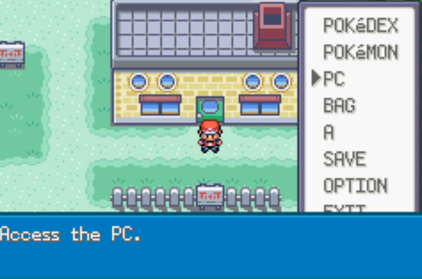
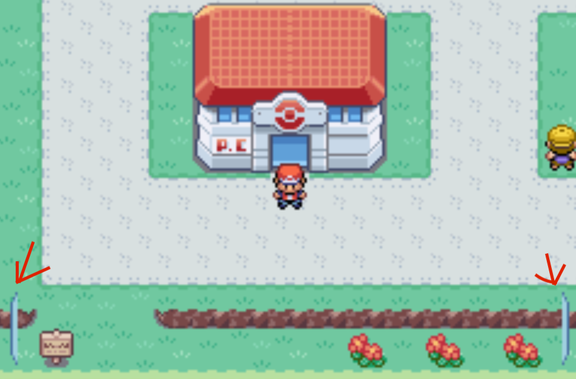

<style>

research{
	color: red
}

</style>

# [<- Notes](../Notes.md)

## Accessing the PC in the pause menu.

The purpsoe of this addon is to add the option to access the pokemon storage from the pause menu in game without needing to use a PC terminal in a pokemon center.

Steps Needed:

1. Add a variable containing the name of the menu item
2. Add an option to the menu that includes that name
3. Add the functionality to access the PC when the button is pressed
4. Fix glitches that appear.

<hr/>

### 1. Add variable containing the name of the menu item.

a) Inside of `Strings.c` Add the following lines with the other menu options

```C
const u8 gText_MenuPC[] = _("PC");
const u8 gStartMenuDesc_PC[] = _("Access the PC.");
```

b) Inside of `Strings.h` Add the folowing lines with the other menu options so it can be accessed from other files.

```C
extern const u8 gText_MenuPC[];
extern const u8 gStartMenuDesc_PC[];
```

### 2. Adding new option to the start menu

For all of step 2 we will be modifying the file called ```sr/cstart_menu.c```

a) Add option to the enum list of menu options. This will be used for adding functionality later.

```C
enum StartMenuOption
{
    STARTMENU_POKEDEX = 0,
    STARTMENU_POKEMON,
    STARTMENU_PC, // Add this new enum
    STARTMENU_BAG,
    STARTMENU_PLAYER,
    STARTMENU_SAVE,
    STARTMENU_OPTION,
    STARTMENU_EXIT,
    STARTMENU_RETIRE,
    STARTMENU_PLAYER2,
    MAX_STARTMENU_ITEMS
};
```

b) You will then add the new description string we made to the menu's description list.

```C
static const u8 *const sStartMenuDescPointers[] = {
    gStartMenuDesc_Pokedex,
    gStartMenuDesc_Pokemon,
    gStartMenuDesc_PC, // Add this line
    gStartMenuDesc_Bag,
    gStartMenuDesc_Player,
    gStartMenuDesc_Save,
    gStartMenuDesc_Option,
    gStartMenuDesc_Exit,
    gStartMenuDesc_Retire,
    gStartMenuDesc_Player};
```

c) You will then need to add a callback, this is the function that will be called when the menu option is selected. This here just "links" the action and the label option together.

```C
static const struct MenuAction sStartMenuActionTable[] = {
    {gText_MenuPokedex, {.u8_void = StartMenuPokedexCallback}},
    {gText_MenuPokemon, {.u8_void = StartMenuPokemonCallback}},
    {gText_MenuPC, {.u8_void = StartMenuPCCallback}}, // Add this line
    {gText_MenuBag, {.u8_void = StartMenuBagCallback}},
    {gText_MenuPlayer, {.u8_void = StartMenuPlayerCallback}},
    {gText_MenuSave, {.u8_void = StartMenuSaveCallback}},
    {gText_MenuOption, {.u8_void = StartMenuOptionCallback}},
    {gText_MenuExit, {.u8_void = StartMenuExitCallback}},
    {gText_MenuRetire, {.u8_void = StartMenuSafariZoneRetireCallback}},
    {gText_MenuPlayer, {.u8_void = StartMenuLinkPlayerCallback}}};
```

d) Now we'll add the new function from above & leave it blank (we'll just return false & do nothing)

```C
static bool8 StartMenuPCCallback(void)
{
	// We will fill the callback in later, for now this will do nothing
	return FALSE;
}
```

If you build and run the game the option will not appear yet. This is because the option on the menu appear dynamically basedon what the player has done and how they've progresed the story. We'll go ahead and add the option to the menu so that it appear at the same time the "Pokemon" option appears.

e) Adding the PC Option to visually appeaer on the start menu

```C
static void SetUpStartMenu_NormalField(void)
{
    if (FlagGet(FLAG_SYS_POKEDEX_GET) == TRUE)
        AppendToStartMenuItems(STARTMENU_POKEDEX);
    if (FlagGet(FLAG_SYS_POKEMON_GET) == TRUE) // This flag here is set when you get your first pokemon.
	{ // Start
		AppendToStartMenuItems(STARTMENU_POKEMON);
		AppendToStartMenuITems(STARTMENU_PC); // Add This line (and the 'Start' and 'End' lines too)
	} // End
    AppendToStartMenuItems(STARTMENU_BAG);
    AppendToStartMenuItems(STARTMENU_PLAYER);
    AppendToStartMenuItems(STARTMENU_SAVE);
    AppendToStartMenuItems(STARTMENU_OPTION);
    AppendToStartMenuItems(STARTMENU_EXIT);
}
```

Your menu should now look like this:



3. Now that we see the option, let's add the functionality.

In thefunction we created ```StartMenuPCCallback``` we'll copy over the option from the bag menu so we can have our boilerplate & we'll replace the callback with the option shown below.

``` C
    u8 taskId;

    if (!gPaletteFade.active)
    {
        PlayRainStoppingSoundEffect();
        DestroySafariZoneStatsWindow();
        CleanupOverworldWindowsAndTilemaps();

        // Call the open pokemon storage with the option to "Move Pokemon (2)"
        EnterPokeStorage(2); // This line instead of the existing BAG callback.
        return TRUE;
    }

    return FALSE;
```

```EnterPokeStorage``` should throw an error when building since you haven't included the file it belongs to in our file to add the file include this line at the top of the file with all the other ```#include``` lines:

``` C
    #include "pokemon_storage_system.h"
```

The function ```EnterPokeStorage``` does not currently exist in our context, it exists in the file ```pokemon_storage_system_tasks.c``` so in order to access it, we'll have to go in and make it accessible to this file.

Inside ```include/pokemon_storage_system.h``` we'll add the following line which will allow the function to be accessible from other files


``` C
    void EnterPokemonStorage(u8);
```

As far as I'm aware, this file is the header file for all the ```pokemon_storage_system_OTHER``` files.

At this point you can rebuild and try out the option & it will enter the pokemon storage menu.

Once you leave the pokemon storage from the menu you will see there is a glitch with the text box at the bottom.




This happens because when you exit the pokemon storage from the actual PC terminal, it will give you the options to withdraw pokemon, move pokemon, etc. We are not entering the pokemon storage in the same way, so we have to instead have the exit callback be different.

4. There will be two options on how to fix this:

* A) Remove the functionality entirely and then just exit the menu fully from menu or from the PC terminal.

* B) Add a flag to know when entering from the Menu and send back the correct callback.


Option A is the easiest in my opinion, but you do lose that menu when you exit from the PC terminal. I don't think this is a big deal since most players leaving the pokemon storage are ready to continue their adventure, so not really a loss. Here is how you would achieve this.

in ```pokemon_storage_system_menu.c``` there is a function called ```FieldTask_ReturnToPcMenu```

Here is what you would change there.

``` C
static void FieldTask_ReturnToPcMenu(void)
{
    u8 taskId;
    MainCallback vblankCb = gMain.vblankCallback;

    SetVBlankCallback(NULL);
    taskId = CreateTask(Task_PCMainMenu, 80);
    gTasks[taskId].tState = STATE_LOAD;
    gTasks[taskId].tSelectedOption = sPreviousBoxOption;
    Task_PCMainMenu(taskId);
    // SetVBlankCallback(vblankCb);         // Original line, remove or comment this out
    SetVBlankCallback(CB2_ReturnToField);   // Add this new line that will callback the "return to field" call which will go straight back to the player.
    FadeInFromBlack();
}
```

Option B is the best option to not change too much of the game, but it is a little bit more involved, though not much.

First you will need to add a new flag in ```include/constants/flags.h```

``` C
#define FLAG_MENUPOKEMONPC 0x0AF
// #define FLAG_0x0AF 0x0AF
```

Flags must use be set to value which they are associated to, the line I commented out is a flag that is unused by the game, so instead of using a new one, I reused this one. You are welcome to use another flag value, it just can't be used by any other flag.

Now that we have a flag, we can modify ```pokemon_storage_system.menu.c``` and change the function called ```FieldTask_ReturnToPcMenu```

``` C
u8 taskId;
    MainCallback vblankCb = gMain.vblankCallback;

    SetVBlankCallback(NULL);
    taskId = CreateTask(Task_PCMainMenu, 80);
    gTasks[taskId].tState = STATE_LOAD;
    gTasks[taskId].tSelectedOption = sPreviousBoxOption;
    Task_PCMainMenu(taskId);
    
    // Start of new lines
    if (FlagGet(FLAG_MENUPOKEMONPC) == TRUE)
    {
        SetVBlankCallback(vblankCb);
    }
    else
    {
        SetVBlankCallback(CB2_ReturnToField);
    }
    // End of new lines

    FadeInFromBlack();
```

The additional code will simply check if the PC is being accessed from a PC and if it is, it will do all its regular things, if not then it will direclty return control and the screen back to the player.

Lastly in order to actually have the flag be set, we need to set the flag when the PC is accessed from it's menu.

We'll edit ```data/scripts/pc.inc```

We'll look for the line ```playse SE_PC_ON```, it should be in a function called ```EventScript_PC``` and we'll set the flag there with:

```
	setflag FLAG_MENUPOKEMONPC
```

Now the flag is set when the pokemon storage is accessed from a PC terminal.

Then we clear the flag when the player exits the pokemon storage through the PC terminal.

We add a line in: ```EventScript_TurnOffPC``` function before the ```releaseall``` call:

```
    clearflag FLAG_MENUPOKEMONPC
```

Now the textboxes won't appear and it will all work perfectly fine.
