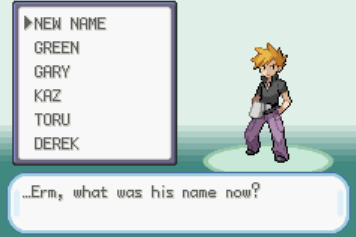

# [<- Notes](../Notes.md)

## Adding a new rival name

This will add a new name to the rival screen, increasing the amount of names to 5 (repeat for multiple names)

In order to add a new name to the you will need to edit the following files:

- event_script.h

  - You will need to add a new u8 constant to store a new name

  ```C
  extern const u8 gNameChoice_Derek[];
  ```

- new_game_intro.inc

  - You will need to add a name string with a terminating character

  ```C
  gNameChoice_Derek::
  .string "DEREK$"
  ```

- oak_speech.c

  - First you'll need to add the new name variable to the `sRivalNameChoice` Array (This is what it should look like after)
    (near line 595)

  ```C
  #if defined(FIRERED)
        gNameChoice_Green,
        gNameChoice_Gary,
        gNameChoice_Kaz,
        gNameChoice_Toru,
  	  gNameChoice_Derek,
  ```

  - You will then need to add a new selection option in the `Task_OakSpeech_HandleRivalNameInput`

  ```C
  	case 0: // NEW NAME
  			PlaySE(SE_SELECT);
  			BeginNormalPaletteFade(PALETTES_ALL, 0, 0, 16, RGB_BLACK);
  			gTasks[taskId].func = Task_OakSpeech_DoNamingScreen;
  			break;
  	case 1: // Default name options
  	case 2: //
  	case 3: //
  	case 4: //
  	case 5: // This is the new selection & it should just cascade down.
  ```

  - You will then need to edit a few parts of `PrintNameChoiceOptions`

  - Change the spacing between the Name options.

    Here you will change the spacing between options from 16 to 12.

  ```C
  for (i = 0; i < ARRAY_COUNT(sRivalNameChoices); i++)
  	AddTextPrinterParameterized(tMenuWindowId, FONT_NORMAL, textPtrs[i], 8, 12 * (i + 1) + 1, 0, NULL);
  ```

  - Change the distance the cursor will move by

    Here you will also change the distance the cursor travels by the same distance as the spacing from above.

  ```C
  Menu_InitCursor(tMenuWindowId, FONT_NORMAL, 0, 1, 12, 5, 0);
  ```

  - Change the amount of options the curson can traverse before circuling back to the top/bottom.

    Lastly you will update the amount of option the cursor can move to from 5 to 6 (or amount added).

  ```C
  Menu_InitCursor(tMenuWindowId, FONT_NORMAL, 0, 1, 12, 6, 0);
  ```

  - (Optional) Increase window size

  * Edit the struct `sIntro_WindowTemplates`

  _Note: With this option you don't need to change the spacing between options (You'll still need spacing if you add multiple new options)_

  ```C
  [WIN_INTRO_NAMES] =
  	{
  		.bg = 0,
  		.tilemapLeft = 2,
  		.tilemapTop = 1, // This move closer to the top
  		.width = 12,
  		.height = 12, // This increases
  		.paletteNum = 15,
  		.baseBlock = 1},
  ```

  This is what it will look like if you change the screen it appears on.

  

<hr/>
